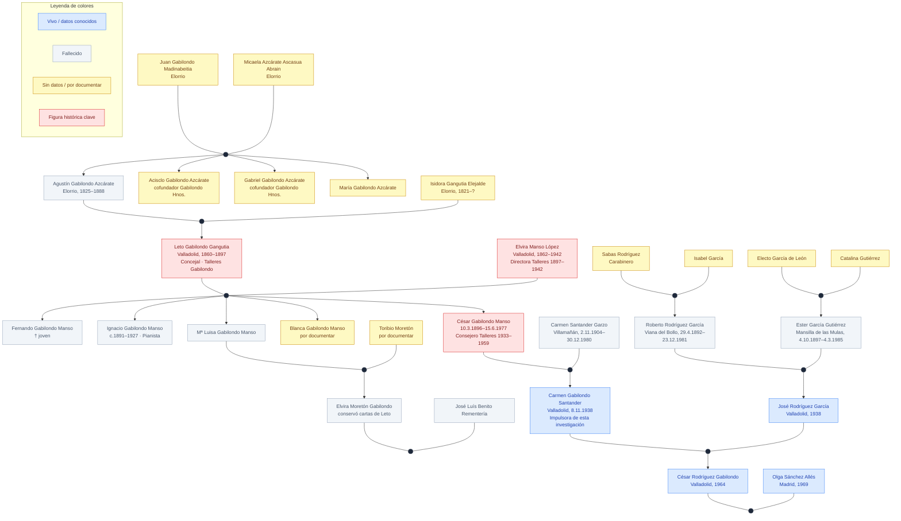

# Árbol familiar Gabilondo

Visión general de la familia Gabilondo de Valladolid, desde los miembros más antiguos documentados hasta el presente.

## Árbol genealógico

### Rama Gabilondo (línea materna de César Rodríguez)

```
Juan Gabilondo Madinabeitia ─── Micaela Azcárate Ascasua Abrain
               (Elorrio)
                         │
         Agustín Gabilondo Azcárate (Elorrio, 1825 – Nanclares de la Oca, 1888)
                  ─── Isidora Gangutia Elejalde (Elorrio, 1821 – ?)
                         │
          ┌──────────────┼────────────────┐
       Acisclo         Gabriel          María
   Gabilondo Azcárate  Gabilondo Azcárate  Gabilondo Azcárate
   (cofundador)        (cofundador)
                         │ (hijo de Agustín)
   Leto Gabilondo Gangutia (Valladolid, 1860–1897)
          ─── Elvira Manso López (Valladolid, 1862–1942)
                         │
    ┌──────────┬──────────┬──────────┬──────────┐
 Fernando   Ignacio   Mª Luisa   Blanca    César
 Gabilondo  Gabilondo Gabilondo Gabilondo Gabilondo
  Manso      Manso     Manso     Manso     Manso
 (†joven)  (1891?–    (─── Toribio Moretón)  (10.3.1896–
          1927)                               15.6.1977)
                         │ (César)
         César Gabilondo Manso ─── Carmen Santander Garzo (Villamañán, León, 2.11.1904–30.12.1980)
                                  │
                    Carmen Gabilondo Santander (Valladolid, 8.11.1938)
```

### Rama Rodríguez (línea paterna de César Rodríguez)

```
Sabas Rodríguez (Carabinero) ─── Isabel García
              │
  Roberto Rodríguez García (Viana del Bollo, 29.04.1892 – 23.12.1981, Valladolid)

Electo García de León ─── Catalina Gutiérrez
              │
  Ester García Gutiérrez (Mansilla de las Mulas, 4.10.1897 – Murcia, 4.03.1985)

Roberto Rodríguez García ─── Ester García Gutiérrez
                            │
             José Rodríguez García (Valladolid, 1938)
```

### Convergencia

```
Carmen Gabilondo Santander (Valladolid, 1938) ─── José Rodríguez García (Valladolid, 1938)
                                                  │
                        César Rodríguez Gabilondo (Valladolid, 1964) ─── Olga Sánchez Allés (Madrid, 1969)
```

## Diagrama interactivo

> **Convenciones de línea:** `───` matrimonio (sin flecha) · `──►` descendencia · `(●)` nodo de unión conyugal



## Miembros documentados

### Juan Gabilondo Madinabeitia y Micaela Azcárate Ascasua Abrain (Elorrio)
Bisabuelos paternos de Leto. Naturales de Elorrio (Vizcaya). En la familia había herreros y artesanos.[^1]

### Agustín Gabilondo Azcárate (Elorrio, 1825 – Nanclares de la Oca, 1888)
Fundador de la rama vallisoletana de la familia. Llegó desde Elorrio junto con sus hermanos Acisclo, Gabriel y María para establecerse en Valladolid tras la llegada del ferrocarril (1856–1860). Falleció el 2-8-1888 a los 64 años. → Ver [página](agustin_gabilondo.md).

### Isidora Gangutia Elejalde (Elorrio, 1821–?)
Esposa de Agustín Gabilondo Azcárate, también natural de Elorrio. Hija de Pedro Bernardino Gangutia Zengotita Zabala y Ángela Elejalde González Apodaca.[^1]

### Acisclo Gabilondo Azcárate (Elorrio)
Hermano de Agustín y cofundador de «Gabilondo Hermanos».[^1] Información pendiente de documentar.

### Gabriel Gabilondo Azcárate (Elorrio)
Hermano de Agustín y cofundador de «Gabilondo Hermanos».[^1] Casado con Flora (mencionada en cartas de Leto). Información pendiente de documentar.

### María Gabilondo Azcárate (Elorrio)
Hermana de Agustín, emigró a Valladolid con los demás hermanos.[^1] Información pendiente de documentar.

### Leto Gabilondo Gangutia (Valladolid, 1860–1897)
Hijo de Agustín e Isidora. Concejal del Ayuntamiento de Valladolid (1888–1892). Propietario de los [Talleres Gabilondo](talleres_gabilondo.md). Murió de paro cardiaco el 9-11-1897, a los 37 años. La [Calle de Gabilondo](calle_gabilondo.md) lleva su nombre. → Ver [página completa](leto_gabilondo.md).

### Elvira Manso López (Valladolid, 1862–1942)
Esposa de Leto. A su muerte asumió la dirección de los Talleres Gabilondo con cinco hijos a su cargo. Fundó Talleres Gabilondo S.A. en 1904. Hermana de Ubaldo Manso. → Ver [página](elvira_manso.md).

### Ubaldo Manso
Hermano de Elvira Manso. Consejero fundador de Talleres Gabilondo S.A. (1904).[^1] Fue el apoyo familiar de Elvira en la dirección de la empresa. → Ver [página](ubaldo_manso.md).

### Fernando Gabilondo Manso
Hijo mayor de Leto y Elvira. Se preparaba para ser ingeniero y hacerse cargo de los talleres, pero falleció joven —antes que su hermano Ignacio (†1927)—.[^1] Fecha exacta de muerte no documentada. → Ver [página](fernando_gabilondo.md).

### Ignacio Gabilondo Manso (c. 1891–1927)
Hijo de Leto y Elvira. Pianista de reconocido prestigio, activo entre 1914 y 1927. Discípulo del maestro Jacinto R. Manzanares en Valladolid; se formó también en Madrid y París. Tenía su estudio en el Pasaje Gutiérrez de Valladolid. Interpretó a Granados, Albéniz, Beethoven, Chopin y otros. Falleció el 29 de julio de 1927 a los **36 años**.[^1] → Ver [página](ignacio_gabilondo.md).

### María Luisa Gabilondo Manso
Hija de Leto y Elvira. Casada con **Toribio Moretón**. Madre de **Elvira Moretón Gabilondo**, quien a su vez se casó con **José Luís Benito Rementería** y fue quien conservó y transmitió las cartas originales de Leto.[^1]

### Blanca Gabilondo Manso
Hija de Leto y Elvira. Información pendiente de documentar.

### César Gabilondo Manso (Valladolid, 10.3.1896 – 15.6.1977)
Hijo menor de Leto y Elvira. Se quedó huérfano con apenas un año. Casado con Carmen Santander Garzo. Padre de Carmen Gabilondo Santander. → Ver [página](cesar_gabilondo.md).

### Carmen Santander Garzo (Villamañán, León, 2.11.1904 – 30.12.1980)
Esposa de César Gabilondo Manso. Madre de Carmen Gabilondo Santander.

### Sabas Rodríguez e Isabel García
Abuelos paternos de José Rodríguez García. Sabas Rodríguez era Carabinero. Información pendiente de documentar.

### Electo García de León y Catalina Gutiérrez
Abuelos maternos de José Rodríguez García, a través de su madre Ester García. Información pendiente de documentar.

### Roberto Rodríguez García (Viana del Bollo, 29.04.1892 – Valladolid, 23.12.1981)
Abuelo paterno de César Rodríguez Gabilondo. Hijo de Sabas Rodríguez e Isabel García.

### Ester García Gutiérrez (Mansilla de las Mulas, 4.10.1897 – Murcia, 4.03.1985)
Abuela paterna de César Rodríguez Gabilondo. Hija de Electo García de León y Catalina Gutiérrez.

### Carmen Gabilondo Santander (Valladolid, 8.11.1938)
Nieta de Leto y Elvira; hija de César Gabilondo Manso y Carmen Santander Garzo. Casada con José Rodríguez García (1938). Impulsora de la investigación sobre la historia familiar. → Ver [página](carmen_gabilondo.md).

### José Rodríguez García (Valladolid, 1938)
Esposo de Carmen Gabilondo Santander. Hijo de Roberto Rodríguez García y Ester García Gutiérrez. Información pendiente de documentar.

### César Rodríguez Gabilondo (Valladolid, 1964)
Hijo de Carmen y José. Casado con Olga Sánchez Allés (Madrid, 1969). Editor de esta wiki. → Ver [página](cesar_rodriguez_gabilondo.md).

## Conexión con Valladolid

La familia Gabilondo tiene raíces profundas en Valladolid. Los [Talleres Gabilondo](talleres_gabilondo.md) estaban situados en la zona de San Ildefonso, cerca del Paseo de Zorrilla. La presencia de la familia en la vida pública de la ciudad quedó plasmada en el nombre de la [Calle de Gabilondo](calle_gabilondo.md).

## Lagunas conocidas

- Datos biográficos detallados de José Rodríguez García
- Información sobre Sabas Rodríguez, Isabel García, Electo García de León y Catalina Gutiérrez
- Datos de Acisclo, Gabriel y María Gabilondo Azcárate
- Datos de Blanca Gabilondo Manso
- Fecha de muerte de Fernando Gabilondo Manso
- Datos biográficos de Toribio Moretón (marido de María Luisa Gabilondo Manso)

## Fuentes

[^1]: Isabel Gabilondo Santander, *Leto Gabilondo, un vallisoletano ilustre. Documentos, cartas, fotografías y apostilla imaginada*. Valladolid, 2012. Dep. Legal: VA-898-2012. (Fuente interna: `raw/import/Libro del abuelo Leto por Isabel Gabilondo - copia.pdf`)
